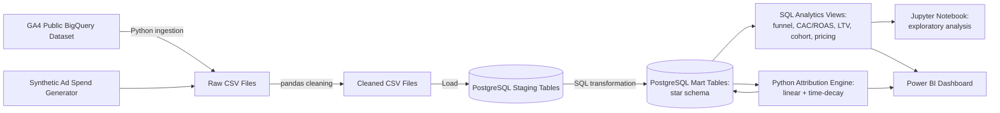
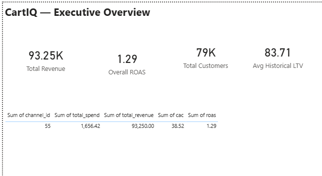
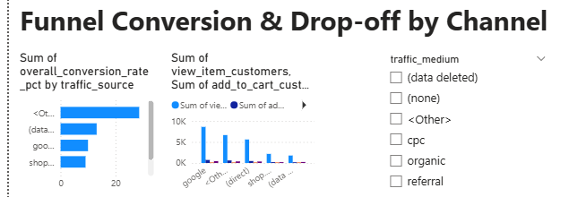
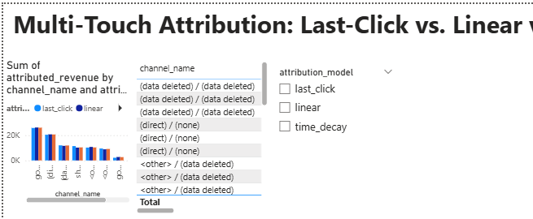

# CartIQ — Funnel Drop-off, Pricing & Marketing Attribution Platform

> Which marketing channels actually drive profitable growth, once you stop crediting the last click for everything?

## Business Problem

Last-click attribution over-credits channels that simply close sales and heavily under-credits upper-funnel channels that build initial awareness. When marketing budgets are allocated solely based on last-click data, companies starve their awareness channels of investment, ultimately collapsing the top of the funnel and leading to misallocated marketing spend.

## Business Questions Answered

- Where do customers drop off in the funnel, and by which channel?
- How does attributed revenue change depending on the attribution model used?
- What is CAC and ROAS for paid channels?
- What is customer lifetime value, and how is it distributed?
- Does pricing/discounting correlate with conversion and revenue?

## Architecture



## Tech Stack

| Layer                     | Tool                          | Why                                                                                   |
| ------------------------- | ----------------------------- | ------------------------------------------------------------------------------------- |
| **Language**        | Python                        | Robust data processing with pandas and seamless DB integrations.                      |
| **Database**        | PostgreSQL                    | Powerful analytical capabilities using window functions and CTEs.                     |
| **Analytics**       | pandas, SQL                   | Fast in-memory operations (pandas) paired with scalable set-based aggregations (SQL). |
| **BI**              | Power BI Desktop              | Industry-standard visualization that connects directly to PostgreSQL.                 |
| **Data Source**     | Google BigQuery Sandbox / GA4 | Access to high-quality real-world e-commerce data via free-tier public datasets.      |
| **Version Control** | Git / GitHub                  | Standard industry practice for code tracking and collaboration.                       |

*Note: Every tool in this stack was deliberately chosen to be genuinely free with no credit card required.*

## Data Sources

This project uses real e-commerce clickstream data from Google's public GA4 sample dataset (the Google Merchandise Store, November 2020). Because no free dataset publishes real ad spend figures, this real behavior data is combined with synthetically generated ad spend and campaign data. The synthetic generator is carefully calibrated against the real per-channel paying-customer volume to produce realistic Customer Acquisition Costs (CAC), ensuring the financial models reflect plausible reality.

## Data Model

CartIQ uses a Kimball-style dimensional star schema:

- **Dimensions:** `customers`, `sessions`, `products`, `marketing_channels`, `campaigns`
- **Facts:** `events`, `orders`, `order_items`, `prices`, `ad_spend`, `customer_touchpoints`

The full Data Definition Language (DDL) scripts can be reviewed in [database/schema/](database/schema/).

## Attribution Methodology

- **Last-Click:** Gives 100% of the revenue credit to the final marketing touchpoint immediately preceding the purchase.
- **Linear:** Splits the revenue credit equally across all touchpoints in a customer's journey.
- **Time-Decay:** Distributes credit across touchpoints but weights recent touches more heavily using a 7-day exponential half-life (a touchpoint 7 days prior to purchase gets half the weight of a touchpoint on the day of purchase).

*Note: This project deliberately does NOT implement first-click or position-based (U-shaped) models to keep the scope of the analysis focused, interpretable, and defensible.*

## AI Budget Recommendation Agent

1. **Architecture:** Deterministic Python/SQL calculates all numbers (CAC, ROAS, linear-attributed revenue, rule-based recommendation) with ZERO LLM involvement. A local LLM (Llama 3.2 3B, run via Ollama - completely free, no API cost, no external API calls) is used ONLY to explain pre-computed numbers in plain business language.
2. **Hallucination-Prevention Safeguard:** Every number in the LLM's response is programmatically extracted and cross-checked against the source data before being trusted, with a `validation_status` field (`PASSED`/`FLAGGED`) recorded for every explanation generated.
3. **Design Rationale:** This design was chosen over "just ask an LLM" because an LLM that calculates its own numbers cannot be trusted for business decisions. Calculation and explanation are deliberately separated - the LLM is a communication layer, not a decision-making layer.
4. **Real Example Output:**
   ```text
   Channel: google / cpc
   Recommendation: Maintain by 0%
   Validation Status: FLAGGED - contains unverified number
   Explanation:
   The recommendation to maintain spend by 0% is based on the current ROAS of $2702.5 and the average monthly spend of $1656.42, resulting in a revenue gain of $1046.08 ($2702.5 - $1656.42). Given the current ROAS is 1.29, maintaining the spend may provide a continued revenue gain without incurring additional costs. Maintaining the spend by 0%.

   Recommended percentage change: 0%
   ```

   *(Note: As seen above, the LLM attempted to do its own math and hallucinated the number 1046.08, which the programmatic validation successfully caught and flagged.)*

## Key Findings

- Multi-touch attribution reveals that assist-heavy channels like "<other></other> / organic" and "<other></other> / referral" are undercounted by last-click attribution by roughly 15-25%, while direct traffic and google/organic barely shift between models - suggesting some channels' true value is hidden if only last-click is used for budget decisions.
- Only one channel (google / cpc) currently has associated ad spend data, yielding a CAC of approximately $38.50 and ROAS of 1.29 - modestly profitable, but a single-channel sample limits confidence; expanding ad spend data to more channels would strengthen this analysis.
- Customer lifetime value is heavily right-skewed: most customers generate relatively low historical revenue, while a small tail of repeat purchasers drives disproportionate revenue - a common e-commerce pattern suggesting retention efforts on top-decile customers could have outsized impact.

## Dashboard


*Executive Overview: High-level KPI tracking of revenue, ROAS, and overall profitability.*


*Funnel Intelligence: Granular drop-off analysis mapping the customer journey from view to purchase.*


*Marketing Attribution: Side-by-side comparisons highlighting revenue shifts when moving beyond last-click models.*

## Data Quality & Debugging Notes

Data pipelines are rarely perfect on the first run. Two real issues found and resolved during this project's development:

1. **Case-Sensitivity Mismatches:** Raw GA4 data contains inconsistent casing (e.g., `<Other>` vs `<other>`). A silent bug excluded roughly 22.5% of attribution touchpoints because the merge keys didn't strictly match. This was audited, caught, and permanently fixed using robust case-insensitive (`LOWER()`) joins across the pandas and SQL pipelines.
2. **Metric Definition Alignment:** CAC and ROAS were initially calculated against *all* visitors touched by a campaign, rather than strictly *paying* customers. This produced an unrealistic ROAS of 0.02. The SQL views and synthetic data generation scripts were rewritten to anchor spend generation exclusively to actual converting customers, aligning the math with reality.

## Project Structure

```text
CartIQ/
├── data/       # Stores raw, cleaned, and processed CSV datasets
├── database/   # Database connection scripts and schema DDLs
├── src/        # Python data pipelines (ingestion, cleaning, attribution)
├── sql/        # SQL logic for staging, marts, and analytical views
├── notebooks/  # Jupyter notebooks for exploratory data analysis
├── dashboard/  # Power BI dashboard files (.pbix)
└── docs/       # Documentation assets and screenshots
```

## How to Run This Project

### Option A: Run Manually

1. Clone this repository to your local machine.
2. Create a Python virtual environment and run `pip install -r requirements.txt`.
3. Copy `.env.example` to `.env` and fill in your PostgreSQL and Google Cloud credentials.
4. Create an empty PostgreSQL database matching your `.env` configuration.
5. Run the schema creation scripts: `database/schema/create_mart_tables.sql` and `sql/staging/create_staging_tables.sql`.
6. Run the raw data extraction scripts in `src/ingestion/`.
7. Run the data cleaning script `src/ingestion/clean_data.py`.
8. Run the database staging loader `src/ingestion/load_staging.py`.
9. Execute the dimensional loading transformations via `sql/marts/transform_to_marts.sql`.
10. Execute the analytical views in `sql/analysis/`.
11. Generate the multi-touch models by running the python scripts in `src/attribution/`.
    *(Note: Steps 5, and 9-11 can be fully automated sequentially by running `src/db/rebuild_all.py`)*
12. Open `dashboard/cartiq_dashboard.pbix` in Power BI Desktop and click "Refresh" to load the live Postgres data.

### Option B: Run with Docker

1. Clone this repository to your local machine.
2. Run `docker compose up --build -d` to start a containerized PostgreSQL instance and Python environment.
3. Run `docker compose exec app python src/db/run_sql_file.py database/schema/create_mart_tables.sql` to set up the mart schema inside the container.
4. Run `docker compose exec app python src/db/run_sql_file.py sql/staging/create_staging_tables.sql` to set up the staging schema inside the container.

*Note: Commands run inside the container use forward slashes for paths, unlike Windows commands. This containerized database starts empty and is separate from a locally-run setup; full data population requires mounting BigQuery credentials into the container.*

## Future Improvements

- Widen the GA4 extraction date range to enable real multi-month cohort retention analysis.
- Add position-based (U-shaped) attribution as a fourth comparison model.
- Implement a data quality test suite (e.g., Great Expectations or dbt tests).
- Dockerize the Python pipeline and database for frictionless one-click deployment.
- Integrate a local-LLM-powered agent to read the SQL views and output automated budget recommendations.
